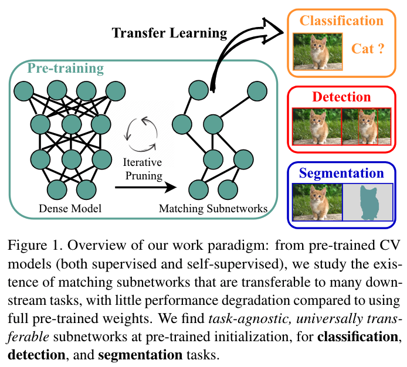
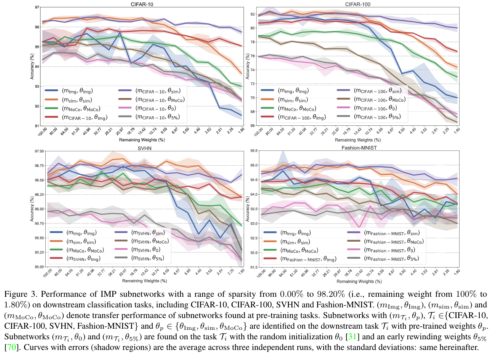
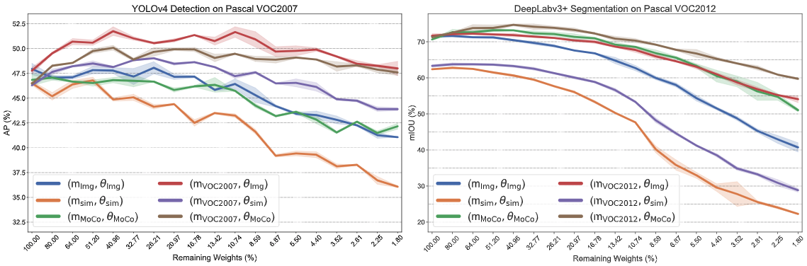
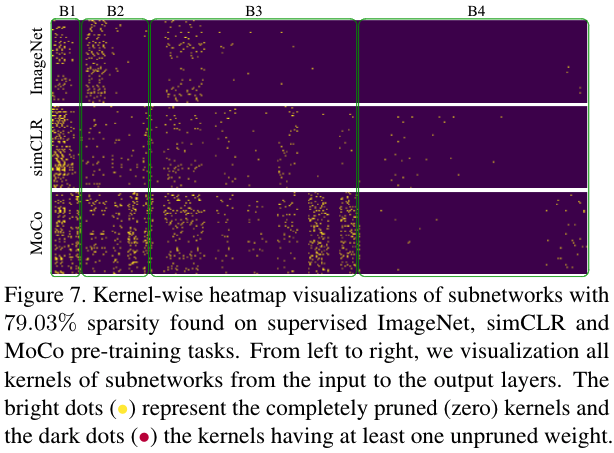

# The Lottery Tickets Hypothesis for Supervised and Self-supervised Pre-training in Computer Vision Models

[](https://opensource.org/licenses/MIT)

Codes for this paper [The Lottery Tickets Hypothesis for Supervised and Self-supervised Pre-training in Computer Vision Models](https://arxiv.org/abs/2012.06908). [CVPR 2021]

Tianlong Chen, Jonathan Frankle, Shiyu Chang, Sijia Liu, Yang Zhang, Michael Carbin, Zhangyang Wang.


## Overview

*Can we aggressively trim down the complexity of pre-trained models, without damaging their downstream transferability?*




## Transfer Learning for Winning Tickets from Supervised and Self-supervised Pre-training

Downstream classification tasks.



Downstream detection and segmentation tasks.




## Properties of Pre-training Tickets




## Reproduce

### Preliminary

#### Required environment:

- pytorch >= 1.5.0 
- torchvision

#### Pre-trained Models

Pre-trained models are provided [here](https://www.dropbox.com/sh/uwois7q7b6mfdg4/AAD493jEVwHB9A8RQPFiOeu0a?dl=0).

```python
imagenet_weight.pt # torchvision std model

moco.pt # pretrained moco v2 model (only contain encorder_q)

moco_v2_800ep_pretrain.pth.tar # pretrained moco v2 model (contain encorder_q&k)

simclr_weight.pt # (pretrained_simclr weight)
```

### Task-Specific Tickets Finding

Remark. for both pre-training tasks and downstream tasks.

#### Iterative Magnitude Pruning 

##### SimCLR task 

```
cd SimCLR 
python -u main.py \
    [experiment name] \ 
    --gpu 0,1,2,3 \    
    --epochs 180 \
    --prun_epoch 10 \ # pruning for ( 1 + 180/10 iterations)
    --prun_percent 0.2 \
    --lr 1e-4 \
    --arch resnet50 \
    --batch_size 256 \
    --data [data direction] \
    --sim_model [pretrained_simclr_model] \
    --save_dir simclr_imp
```

##### MoCo task 

```
cd MoCo
CUDA_VISIBLE_DEVICES=0,1,2,3 python -u main_moco_imp.py \
	[Dataset Direction] \
	--pretrained_path [pretrained_moco_model] \
    -a resnet50 \
    --batch-size 256 \
    --dist-url 'tcp://127.0.0.1:5234' \
    --multiprocessing-distributed \
    --world-size 1 \
    --rank 0 \
    --mlp \
    --moco-t 0.2 \
    --aug-plus \
    --cos \
    --epochs 180 \
    --retrain_epoch 10 \ # pruning for ( 1 + 180/10 iterations)
    --save_dir moco_imp
```

##### Classification task on ImageNet

```
CUDA_VISIBLE_DEVICES=0,1,2,3 python -u main_imp_imagenet.py \
	[Dataset Direction] \
	-a resnet50 \
	--epochs 10 \
	-b 256 \
	--lr 1e-4 \
	--states 19 \ # iterative pruning times 
	--save_dir imagenet_imp
```

##### Classification task on Visda2017

```
CUDA_VISIBLE_DEVICES=0,1,2,3 python -u main_imp_visda.py \
	[Dataset Direction] \
	-a resnet50 \
	--epochs 20 \
	-b 256 \
	--lr 0.001 \
	--prune_type lt \ # lt or pt_trans
	--pre_weight [pretrained weight] \ # if pt_trans else None
	--states 19 \ # iterative pruning times
	--save_dir visda_imp
```

##### Classification task on small dataset

```
CUDA_VISIBLE_DEVICES=0 python -u main_imp_downstream.py \
	--data [dataset direction] \
	--dataset [dataset name] \#cifar10, cifar100, svhn, fmnist 
	--arch resnet50 \
	--pruning_times 19 \
	--prune_type [lt, pt, rewind_lt, pt_trans] \
	--save_dir imp_downstream \
	# --pretrained [pretrained weight if prune_type==pt_trans] \
	# --random_prune [if using random pruning] \
    # --rewind_epoch [rewind weight epoch if prune_type==rewind_lt] \
```

### Transfer to Downstream Tasks

##### Small datasets: (e.g., CIFAR-10, CIFAR-100, SVHN, Fashion-MNIST)

```
CUDA_VISIBLE_DEVICES=0 python -u main_eval_downstream.py \
	--data [dataset direction] \
	--dataset [dataset name] \#cifar10, cifar100, svhn, fmnist 
	--arch resnet50 \
	--save_dir [save_direction] \
	--pretrained [init weight] \
	--dict_key state_dict [ dict_key in pretrained file, None means load all ] \
	--mask_dir [mask for ticket] \
	--reverse_mask \ #if want to reverse mask
```

##### Visda2017:

```
CUDA_VISIBLE_DEVICES=0,1,2,3 python -u main_eval_visda.py \
	[data direction] \
	-a resnet50 \
	--epochs 20 \
	-b 256 \
	--lr 0.001 \
	--save_dir [save_direction] \
	--pretrained [init weight] \
	--dict_key state_dict [ dict_key in pretrained file, None means load all ] \
	--mask_dir [mask for ticket] \
	--reverse_mask \ #if want to reverse mask
```

### Detection and Segmentation Experiments

Detials of YOLOv4 for detection are collected [here](https://github.com/VITA-Group/CV_LTH_Pre-training/blob/main/Detection/README.md).

Detials of DeepLabv3+ for segmentation are collected [here](https://github.com/VITA-Group/CV_LTH_Pre-training/blob/main/Segmentation/README.md).

## Citation

```
@article{chen2020lottery,
  title={The Lottery Tickets Hypothesis for Supervised and Self-supervised Pre-training in Computer Vision Models},
  author={Chen, Tianlong and Frankle, Jonathan and Chang, Shiyu and Liu, Sijia and Zhang, Yang and Carbin, Michael and Wang, Zhangyang},
  journal={arXiv preprint arXiv:2012.06908},
  year={2020}
}
```


## Acknowledgement

https://github.com/google-research/simclr

https://github.com/facebookresearch/moco

https://github.com/VainF/DeepLabV3Plus-Pytorch

https://github.com/argusswift/YOLOv4-pytorch

https://github.com/yczhang1017/SSD_resnet_pytorch/tree/master


